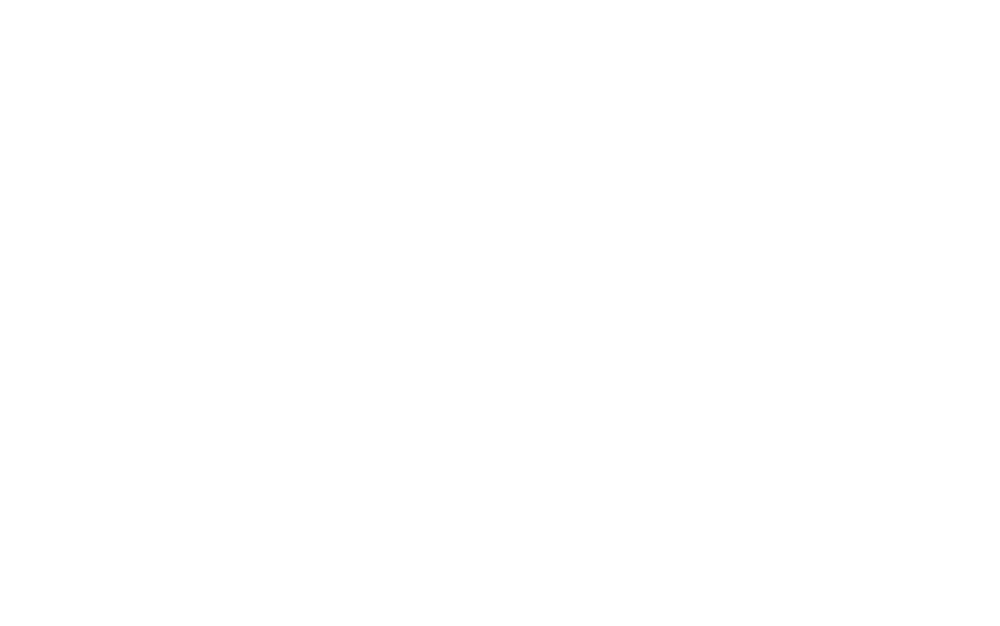

<p align="center">
    <a href="https://clariellelarissa.me" target="blank"></a><br>
</p>

<p align="center"><em>I am convinced that we can change the world through the power of technology. <br> And I want to be part of those who will make it a better place </em><br><br>Don't hesitate to contact me if you hold the same conviction as I do. <br>
</p>

<div align="center">
  
  📫 Send me an email at <em>[25f5k252l@mozmail.com](mailto:25f5k252l@mozmail.com)</em> 
  
</div>  

<h3 align="center">
FIND ME ON ↯ 
</h3>

  <div align="center">
   <a href="https://clariellelarissa.me" target="_blank"> <em>My Website</em> </a> <br><br>
  
  [](https://linkedin.com/in/larissa-clarielle) [](https://www.youtube.com/@TaoWritesCode)
  
</div>

<h2 align="center">  ABOUT ME  <br></h2>
<h1 align="center">
⊂larielle ⌊arissa Δⓝⓓⓡⓐⓘⓝⓐⓢⓞⓐ
</h1>
<div align="center">
  
<div align="left">
  
```ruby
{
  open_to_work: true,
  current_position: [" Freelancer "],
  current_interests: [" Web3  🌐 ", " Leadership "],
  pronouns: " She/Her 🦄",
}
``` 
</div>

<!-- ## EXPERIENCES 


| Timeline | Role |
|--------|--------|
| May 2023 - Apr 2024 | Part-Time Code Reviewer at [**Microverse**](https://www.microverse.org/?grsf=3zrltn) 💻 |
| Jan 2023 - Aug 2023 | Peer Mentor at [**Microverse**](https://www.microverse.org/?grsf=3zrltn) 📍 |
| May 2019 - Nov 2022 | Small Business Owner (Beekeeping) 🐝 |
| May 2016 - May 2018 | Freelance English as a Second Language Teacher in China 🔊 |
    
  
</div>

-->

<h2 align="center"> :octocat: GITHUB STATS </h2>

<p align="center">

</p>

<div align="center">

  | GENERAL | MOST USED LANGUAGES |
|--------|--------|
| <br/>  |  | 

</div>     

<h2 align="center">  TECH STACK </h2>
<div align="center">
  
|  |
|--------|
| **LANGUAGES** |
|       |
| **FRAMEWORKS, DATABASES, & LIBRARIES** | 
|  |
| **OTHER** |
|      |
  
</div>

<h1 align="center">My templates</h1>
<p align="center">

|  |  |
|--------|--------|
| <a href="https://github.com/rica213/vite-react-startup-project-template"></a> | <a href="https://github.com/rica213/ruby-startup-project-template"></a> |
| <a href="https://github.com/rica213/set-up-webpack"></a> | <a href="https://github.com/rica213/rails-startup"></a> | 
</p>


