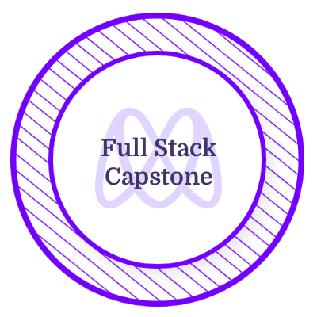

<p align="center">
<br>
</p>

<p align="center"><em>I am convinced that we can change the world through the power of technology. <br> And I want to be part of those who will make it a better place </em><br><br>Don't hesitate to contact me if you hold the same conviction as I do. <br>
</p>

<div align="center">
  
  📫 Send me an email at <em>[25f5k252l@mozmail.com](mailto:25f5k252l@mozmail.com)</em> 
  
</div>  

<h3 align="center">
FIND ME ON ↯ 
</h3>
  
  <div align="center">
  
  [](https://linkedin.com/in/larissa-clarielle) [](https://www.youtube.com/@TaoWritesCode)[](https://medium.com/@alc3and) [](https://twitter.com/alc3and)
  
</div>

<h2 align="center">  ABOUT ME  <br></h2>
<h1 align="center">
⊂larielle ⌊arissa Δⓝⓓⓡⓐⓘⓝⓐⓢⓞⓐ
</h1>
<div align="center">
  
<div align="left">
  
```ruby
{
  open_to_work: true,
  current_position: [" Code Reviewer 📝 ", " Micronaut  🔭 "],
  current_studies: [" Web Development  🌐 ", " Data Structure  📦 ", " Algorithm  🧮 "],
  current_interests: [" Collaboration  🤝🏾 ", " Software Development Best Practices  ➓ "],
  pronouns: " She/Her 🦄",
}
``` 
</div>
  
  ## **CREDENTIALS 📜**
  
<table align="center">
  <tr>
    <td align="center"><a href="https://www.credential.net/0df80836-25a6-4bd4-bfc3-2fab095da696" target="blank"></a></td>
    <td align="center"><a href="https://www.credential.net/c4dac11e-f496-4fe5-a9a5-601d246ef8f9#gs.xzi7ju" target="blank"></a></td>
    <td align="center"><a href="https://www.credential.net/6ed41ceb-3dff-49e1-9dcc-bf44e2fcdf10" target="blank"></a></td>
    <td align="center"><a href="https://www.credential.net/7147b19f-fe4e-4879-87aa-8dc314c2f151#gs.xzib8y" target="blank"></a></td>
    <td align="center"><a href="https://www.credential.net/829bdb65-5b43-483c-87ce-ca3d64473bd6#gs.2hs46j" target="blank"></a></td>
    <td align="center"><a href="https://www.credential.net/cf9fcdfc-e03f-4b8c-9d57-5b836cfd1363#gs.2hruze" target="blank"></a></td>
    <td align="center"><a href="https://www.credential.net/bdcce9d0-d53a-4d32-83d3-15a6143b381f#gs.4hudpw" target="blank"></a></td>
  </tr>
</table>

## EXPERIENCES 


| Timeline | Role |
|--------|--------|
| May 2023 - Present | Part-Time Code Reviewer at [**Microverse**](https://www.microverse.org/?grsf=3zrltn) 💻 |
| Jan 2023 - Aug 2023 | Peer Mentor at [**Microverse**](https://www.microverse.org/?grsf=3zrltn) 📍 |
| May 2019 - Nov 2022 | Small Business Owner (Beekeeping) 🐝 |
| May 2016 - May 2018 | Freelance English as a Second Language Teacher in China 🔊 |

 ### YOU CAN FIND [MY RESUME HERE](https://drive.google.com/file/d/1H0ZKbTz-YxJTfx79iyPX5trxBmxk7tBk/view?usp=sharing)
  
## **_Where magic comes from ↷_**
<a href="https://github.com/rica213/rica213"></a>      
  
</div>

<h2 align="center"> :octocat: GITHUB STATS </h2>

<p align="center">

</p>

<div align="center">

  | GENERAL | MOST USED LANGUAGES |
|--------|--------|
| <br/>  |  | 

</div>     

<div align="center">
  
  | STREAK _(La consistencia es la clave 🗝 ✊)_|
|--------|
| <br/> | 
  
</div>

<h2 align="center">  TECH STACK </h2>
<div align="center">
  
|  |
|--------|
| **LANGUAGES** |
|        |
| **HOSTING/SAAS** |
|     |
| **FRAMEWORKS, PLATFORMS & LIBRARIES** | 
|         |
| **DATABASES**|
|   |
| **TESTS**|
|   |
| **DESIGN** |
|   |
| **OTHER** |
|         |
  
</div>
  
  <h1 align="center">
   My Top Group Projects I have contributed to
  </h1>
  
<p align="center">

| | |
|--------|--------|
| <a href="https://github.com/rica213/vr-world"></a> | <a href="https://github.com/jonas-45/space-travellers-hub"></a> | 

<h1 align="center">My templates</h1>
<p align="center">

|  |  |
|--------|--------|
| <a href="https://github.com/rica213/vite-react-startup-project-template"></a> | <a href="https://github.com/rica213/ruby-startup-project-template"></a> |
| <a href="https://github.com/rica213/set-up-webpack"></a> | <a href="https://github.com/rica213/rails-startup"></a> | 
</p>


